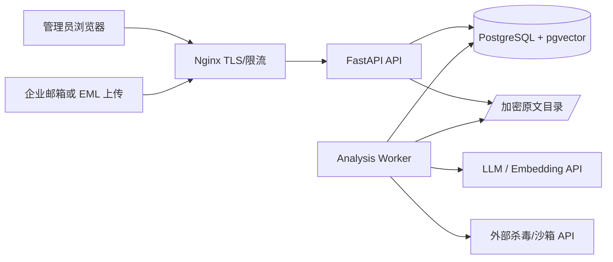
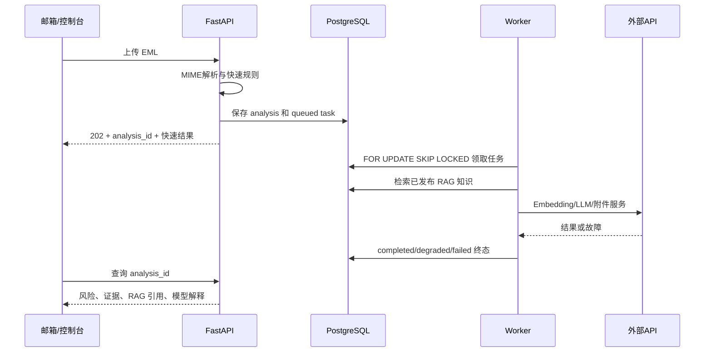

# ShieldDome 详细技术架构说明书

## 1. 部署拓扑

Nginx、FastAPI、Worker 和 PostgreSQL 均运行在单台 Linux 服务器。Vue 控制台构建后由 Nginx 提供静态文件，生产环境不常驻 Node.js。

## 2. 核心组件

- `app/api.py`：FastAPI 接口、鉴权依赖、文件上传与管理 API。
- `app/worker.py`：轮询持久化任务队列并执行深度检测。
- `shielddome/mail_parser.py`：RFC822/MIME、正文、链接、认证结果和附件解析。
- `shielddome/enterprise.py`：检测编排、RAG、LLM 降级和反馈闭环。
- `shielddome/storage.py`：SQLite 开发存储与 PostgreSQL 生产存储。
- `frontend/`：Vue 3、Element Plus 与 ECharts 控制台源码。

## 3. 邮件检测时序

## 4. 数据模型

- `analyses`：快速结果、解析结构、深度结果、状态和错误。
- `tasks`：任务状态、重试次数、领取 Worker、可执行时间和死信错误。
- `knowledge`：知识内容、脱敏内容、类型、审核状态、版本和向量。
- `policies`：可信域名、风险阈值和策略配置。
- `audit_logs`：分析、知识、策略和反馈的不可变操作记录。

生产任务通过 `FOR UPDATE SKIP LOCKED` 领取。任务失败后指数退避重试，超过最大次数进入 `dead/failed`，不会永久停留在 `running`。

## 5. RAG 架构

知识导入后先脱敏并进入 `pending`。管理员审核后变为 `published` 才参与检测。Embedding 维度默认按 BGE-M3 的 1024 维配置；PostgreSQL 使用 pgvector 近邻检索，再与关键词重合度组成混合评分。误报反馈只进入审计和知识提案，不会自动污染可信库。

## 6. 安全与故障处理

- 上传限制 50 MB，知识文件限制 10 MB。
- Nginx 限流、TLS、安全响应头和仅本机反向代理。
- 管理与邮件接入使用不同 API Token。
- LLM/Embedding 失败时降级完成；任务异常进入重试或失败终态。
- 原始邮件目录、环境密钥文件和服务权限由独立 `shielddome` 用户隔离。
