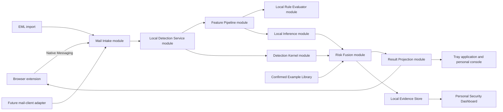

# ShieldDome Endpoint Agent

This directory contains the design and, later, the implementation of the standalone Windows Endpoint Agent. The existing ShieldDome API, Worker, web console, database, and browser extension remain unchanged.

## Current Implementation Status

Phase 4 is `in_progress`: model-neutral Phase 4A and local-detection prerequisite Phase 4A.1 are complete, while production-model Phase 4B remains pending. Phase 3 is intentionally deferred because no Approved Training Corpus or release-eligible Unified Model Release exists. Phase 5 is `in_progress`: Phase 5A is complete and Phase 5B remains pending.

The production package currently provides a fully offline Local Detection Service, Feature Schema 2.0 validation, local structured-rule evaluation, the Detection Kernel, deterministic risk fusion, Model Assessment validation, a stable Local Inference seam, a side-effect-free `UnavailableModelAdapter`, strict Native Messaging framing/payload validation, and a testable Host loop. The standalone development MV3 extension under `endpoint_agent/extension/` uses a chinaccs-specific Mail Intake adapter and Native Messaging only. With no model adapter, detection still returns the deterministic rule result. There is no Host executable, browser registration, real Chrome/Edge acceptance, production ONNX Runtime adapter, or formal model in this repository.

## Product Definition

ShieldDome Endpoint Agent is a per-Windows-user, offline phishing-email detection application.

- Windows 10/11 x64, four CPU cores, 8 GB RAM minimum.
- No discrete GPU requirement.
- Local Mail Risk Model package no larger than 2 GB.
- Agent steady-state memory no larger than 1.5 GB; detection peak no larger than 2.5 GB.
- Rule detection target below 300 ms; model inference target below 3 seconds.
- The Agent never calls a central backend, external model, reputation service, telemetry endpoint, or background updater.
- One Unified Model Release is trained by the company and distributed inside a complete Endpoint Release.
- Endpoint Agents perform inference only. They never retrain from user email.
- Original email and attachment content are not persisted.
- Encrypted Endpoint Evidence Records are retained for 15 days.
- Browser UI displays only risk level, execution state, generic advice, and a local event ID.
- Protection Mode warns and requests confirmation for strongly evidenced high-risk actions, but never deletes, quarantines, or moves email.

## Target Architecture



The Local Detection Service is the Phase 5A Native Messaging Host's top-level detection module. Callers submit only `MailObservation` facts plus host-controlled identity/time context and do not provide rules, scores, Model Assessment, execution state, action, retention, role, permission, or ownership conclusions.

## Deep Modules

### Local Detection Service

Interface:

```text
detect(observation, local_event_id, observed_now) -> detection_outcome
```

Phase 4A.1 fixes the trusted local chain as `MailObservation → FeaturePipeline.transform → LocalRuleEvaluator.evaluate → DetectionKernel.detect → DetectionOutcome`. A Local Inference adapter may be injected only when constructing the module and defaults to `UnavailableModelAdapter`; Feature Pipeline, local rules, risk fusion, and result projection cannot be replaced by the browser. This is the only detection seam intended for the Phase 5 Native Messaging host.

The browser is an untrusted observation source. It must never supply `RuleAssessment`, score contribution, strong-evidence flags, final score/level, `ModelAssessment`, execution state, action, retention deadline, user role/permission, or a trusted ownership conclusion for a local event ID. Phase 4A.1 records this interface but does not implement protocol parsing, Native Messaging, or an extension.

### Detection Kernel

Interface:

```text
detect(feature_vector, rule_assessments, local_event_id, detected_at, inference_context)
  -> detection_outcome
```

The Phase 4A implementation hides Local Inference invocation, Model Assessment validation, adapter-failure degradation, deterministic risk fusion, private evidence projection and the four-field plugin projection. Phase 4A.1 keeps the Kernel interface available for internal composition while moving future intake callers to Local Detection Service, which generates local rules. Mail parsing, protocol intake, similarity lookup, evidence persistence and UI remain outside the current implementation.

### Mail Intake

All intake adapters produce the same normalized `MailObservation`.

- Initial adapter: Chrome/Edge Native Messaging.
- Second adapter: manual or Windows-shell `.eml` import.
- Later adapters: official integrations for Outlook, Foxmail, QQ Mail, or other clients where a supported extension mechanism exists.

Mail Intake never reads proprietary mailbox databases, intercepts network traffic, injects client processes, or bypasses client access controls.

### Feature Pipeline

Training and endpoint inference must cross the same seam and use the same feature-schema version.

Feature families:

- SPF, DKIM, DMARC and authentication availability.
- Sender and reply-to consistency.
- Root-domain, subdomain, Unicode, punycode and display-address properties.
- URL count, visible-target mismatch, redirects, IP literals, suspicious ports and lexical properties.
- Subject/body length and limited sanitized text representation.
- Credential, payment, urgency and impersonation intent indicators.
- Attachment Metadata Assessment only: name, declared type, size and dangerous extension properties.
- Existing deterministic rule IDs and protective evidence.

### Local Inference

The stable Phase 4A seam accepts a `FeatureVector` plus an explicit inference budget. The production `UnavailableModelAdapter` reports that no model is configured without inventing probability or model version and without network/file side effects. Deterministic fake adapters exist only under `tests/`.

Phase 4B will add the first production ONNX Runtime CPU adapter only after Phase 3 produces a release-approved Unified Model Release. No empty or misleading ONNX adapter placeholder is present.

Output is a `ModelAssessment` containing:

- phishing probability;
- confident-benign, uncertain, or confident-phishing state;
- model and feature-schema versions;
- inference duration;
- completed, unavailable, incompatible, or failed status.

The model never returns natural-language reasons or a final risk level.

### Risk Fusion

Risk Fusion combines deterministic evidence, Model Assessment, and bounded similarity evidence from the Confirmed Example Library.

- Model-only evidence cannot create a critical result.
- Uncertain model output adds no strong risk evidence.
- Similar benign examples have a bounded protective effect.
- Similar phishing examples have a bounded risk effect.
- Strong authentication, blacklist, URL and attachment-metadata evidence cannot be cancelled by similarity.
- Model failure always degrades to deterministic rules.
- Duplicate rule IDs contribute once using a stable conservative selection.
- Strong rule severities establish risk floors of 20, 40, 70 and 90.
- Confident phishing contributes at most 25 points; confident benign removes at most 5 and never crosses a strong floor.
- An uncertain model adds no score but, without stronger rule advice, projects `verify_sender` instead of `continue`.
- Final scores are deterministically clamped to 0–100 and mapped centrally to low, medium, high or critical.

### Local Evidence Store

- Per-user storage under `%LOCALAPPDATA%`.
- Encryption key protected with Windows DPAPI.
- AES-GCM encrypted structured records.
- No original `.eml`, full body, attachment content, credentials, tokens, or full recipient lists.
- Automatic deletion after 15 days.
- No network upload.
- Explicit user action is required to export a sanitized diagnostic package.

### Confirmed Example Library

The library stores only sanitized features, vectors, labels and hashes for user-confirmed examples. It calibrates similar future email with bounded evidence and never changes model weights.

### Endpoint Release

- One complete installer contains Agent, browser extension, Unified Model Release and policy.
- Models are not hot-updated independently.
- Startup verifies a release manifest and model SHA-256.
- Installation directories are not writable by ordinary users.
- The previous complete release is retained for rollback.
- Unsupported or damaged models cause rule-only degradation.

## Model Development

### Model Shape

Use a license-approved Chinese/English pretrained text encoder plus ShieldDome-owned feature extraction, classification, calibration and risk fusion.

Recommended progression:

1. Structured-feature baseline using logistic regression or gradient-boosted trees.
2. Frozen multilingual text embeddings combined with structured features.
3. Fine-tune the encoder only after the Approved Training Corpus is large and diverse enough.
4. Export the chosen model to ONNX and apply validated quantization.

The target is approximately 500 MB, not the 2 GB maximum. The maximum exists as a release guardrail.

### Approved Training Corpus

- License-compatible public benign and phishing email datasets.
- ShieldDome simulated phishing and benign enterprise templates.
- Human-confirmed phishing cases.
- No unreviewed personal inbox email.
- RAG or feedback records are candidates only; they require review before inclusion.
- Every candidate must carry non-sensitive label-guideline, label-evidence, reviewer, source-dataset and source-evidence identifiers.
- Authorization must be approved or active, unexpired at admission, and separately allow internal training and endpoint model-weight distribution.
- Privacy review must be approved and bind a sanitization-policy version, privacy-evidence digest and sanitized-representation digest.
- Deduplicate by raw hash, normalized hash and template/near-duplicate clustering.
- Split by source, campaign/template and time to prevent leakage.
- Keep immutable dataset, corpus and feature-schema versions plus a deterministic manifest digest for every model release.

`CorpusGovernance.prepare` is the only admission seam for these facts. Missing, unsafe or inconsistent governance metadata is rejected with a stable code; rejected values are never copied into the rejection record. This hardening does not create an Approved Training Corpus and does not start Phase 3 model work.

### Release Gates

- Phishing recall at least 95%.
- Benign false-positive rate no more than 1%.
- High-confidence phishing precision at least 90%.
- Abstention rate no more than 25%.
- Report Chinese, English and mixed-language results separately.
- Report browser, EML and public-source results separately.
- Lowest supported hardware inference below 3 seconds.
- Rule-only degradation passes for timeout, memory pressure, corruption and incompatibility.
- No key metric may regress from the currently released model without explicit approval.

## Local User Experience

### Browser

- Risk level: low, medium, high or critical.
- State: complete, uncertain, degraded or unavailable.
- Generic action: continue, verify sender, avoid credentials, or contact security staff.
- Local event ID.
- No model reason, internal rule detail, RAG content, model name or policy weight.

### Tray And Personal Console

- Agent and model status.
- Drag-and-drop `.eml` detection.
- Today's detection count.
- Fifteen-day detection trend.
- Risk distribution and intake-source distribution.
- Model abstention and degradation counts.
- Local 15-day evidence history.
- Confirmed Example Library management.
- False-positive and missed-phishing feedback.
- Sanitized diagnostic export and local-data deletion.

## Attachment Safety

The first release performs Attachment Metadata Assessment only.

- Do not download attachments automatically.
- Do not open, preview, extract or execute attachments.
- Do not invoke Office, PDF readers, shell handlers or system preview.
- Identify suspicious names, double extensions, dangerous declared types, sizes and encrypted-archive indicators already exposed by the mail client.

A future isolated attachment-inspection process must be designed and security-reviewed separately. It must never run inside the Agent process.

## Proposed Directory Layout

```text
endpoint_agent/
  README.md
  pyproject.toml
  src/shielddome_endpoint/
    app.py
    intake/
      native_host.py
      eml_import.py
      normalized_mail.py
    detection/
      kernel.py
      feature_pipeline.py
      local_inference.py
      risk_fusion.py
      result_projection.py
      attachment_metadata.py
    storage/
      evidence_store.py
      example_library.py
      crypto.py
      retention.py
    release/
      manifest.py
      integrity.py
      compatibility.py
    ui/
      tray.py
      dashboard.py
  extension/
  training/
    dataset.py
    train_baseline.py
    train_encoder.py
    evaluate.py
    export_onnx.py
  models/
    README.md
  policies/
  packaging/
  tests/
```

Model binaries, training corpora, raw email, local databases, keys and exported diagnostics must remain outside Git.

## Delivery Plan

1. **Foundation**: independent package, normalized mail types, Feature Pipeline and deterministic baseline tests.
2. **Training corpus**: import, licensing metadata, labeling, deduplication, grouping and dataset snapshots.
3. **Baseline model**: structured classifier, calibration, abstention and source/time-split evaluation.
4. **Text model**: approved encoder benchmarking, ONNX export, quantization and hardware profiling.
5. **Detection Kernel**: local inference, risk fusion, result projection and rule-only degradation.
6. **Browser intake**: new MV3 extension and Native Messaging host without HTTP or tokens.
7. **Local storage and UI**: encrypted 15-day evidence, Confirmed Example Library, tray and dashboard.
8. **Endpoint Release**: installer, integrity checks, ACLs, rollback and clean uninstall.
9. **Security validation**: malformed messages, malicious model files, resource exhaustion, Native Messaging abuse and privacy checks.
10. **Expansion**: `.eml` shell integration, then supported mail-client adapters; isolated attachment inspection remains a separate project.

## Non-Goals For The First Release

- Central backend connectivity or cross-user dashboards.
- External LLM, embedding, reputation or telemetry calls.
- Endpoint model training or personalization.
- Automatic email quarantine or deletion.
- Attachment download, extraction, preview or execution.
- Reading proprietary mail-client databases or intercepting mail traffic.
